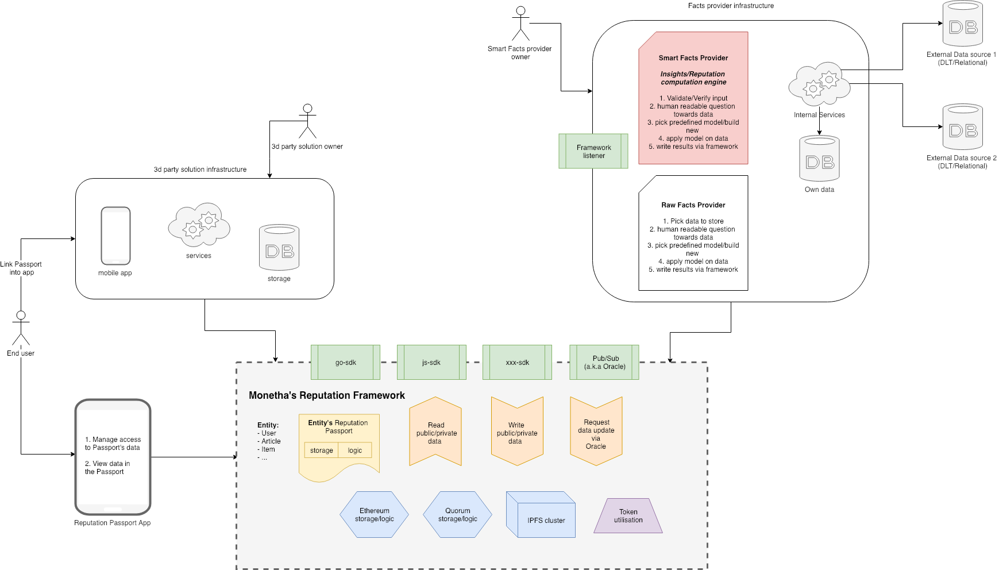

# MONETHA: Decentralized Reputation Framework <!-- omit in toc -->

# Reputation Layer <!-- omit in toc -->

- [Abstract](#abstract)
- [Trust and Reputation Background](#trust-and-reputation-background)
- [Problem Statement](#problem-statement)
- [Reputation Layer Design](#reputation-layer-design)
  - [Actors](#actors)
  - [Implementation](#implementation)
    - [Passport Owners](#passport-owners)
    - [Facts Providers](#facts-providers)
    - [Storage Types](#storage-types)
    - [Public and private data](#public-and-private-data)
    - [Support for permissioned blockchains](#support-for-permissioned-blockchains)
    - [Repositories](#repositories)
- [Vulnerabilities and Attacks](#vulnerabilities-and-attacks)

## Abstract

The Reputation layer behind Monetha's Decentralized Reputation Framework is designed in a way which enables network participants to evaluate the trustworthiness of one another by securely accessing context-relevant information. This helps the parties to ensure that their expectations are met before initiating a transaction with each other.

We aim to increase the confidence and probability of success for any transaction between parties by providing the Reputation layer with the following key elements and possibilities:

- A Reputation Passport, which is a collection of data points about an entity (person, object, organization, etc.) stored in a secure and censorship resistant manner. The Passport is not tied to a single vendor and allows its owners to transfer and use their reputation capital across many platforms;
- Exchange of contextually relevant data with many requestors (applications, platforms, etc.);
- Ownership of data and control of access to it;
- Monetization of reputation capital;
- Utilities for third party developers to build custom applications for specific use cases.

## Trust and Reputation Background

**Trust** is a layered notion, used to refer to several different (although interrelated) meanings between entities _X_ (the trustor) and _Y_ (the trustee):

- In its basic sense, trust is a mental and affective attitude or disposition towards _Y_, or involving two basic types of beliefs: evaluations and expectations;
- In its richer use, trust is a decision and intention based on that disposition;
- as well as the act of relying upon _Y_'s expected behavior;
- and the consequent social relation established between _X_ and _Y_.

**Reputation** is the collective measure of reliability derived from the interactions between parties.

Trust systems produce a score that reflects a personalized view of an entity's trustworthiness, whereas reputation systems produce a reputation score of an individual as seen by the whole community.

Three tenets of distributed reputation systems:

- Entities are long lived and unique (identity solution);
- Ratings about current interactions must be captured and distributed (broadcasting by reputation reporters);
- Ratings about past interactions must guide current decisions (model execution by audit quorum).

### Trust Is Capital <!-- omit in toc -->

There is a complex relationship between power and trust. On the one hand, power (and in particular perceived and appreciated power) makes us trustworthy for others (they may need us and wish to rely on us), and this is why our _social image_ and the _signals_ that we give of our qualities are so important. As we will see, trust (being trusted in a given community and, in particular, being better evaluated than others) is _capital_.

On the other hand, this is capital precisely because it increases our power; it provides us new power. Since we (being perceived as trustworthy) are appreciated and demanded, we can enter in exchange relations, we can receive cooperation, we can influence other people, etc. This means that we greatly enlarge our _practical power_ (the possibility to achieve – thanks to the other's cooperation – our goals) and _social power_, the power on others. Also for being invested by institutional roles (and receiving new special powers) we need some competence and reliability, or even better, we need some trust from others on this. In sum, _power gives trustworthiness and trust from others; and trust gives power._

### Trust Is Context-Dependent <!-- omit in toc -->

Trust is a context-dependent phenomenon and notion. This means that _X_ trusts _Y_ for τ on the basis of a specific context; just by changing the context (for the same τ and the same _Y_) _X_'s attitude and decision might be different.

### Bigger Trust != Pick Him <!-- omit in toc -->

We do not necessarily delegate to the most trustworthy agent; we do not necessarily choose the alternative where the trust is greater. We might prefer to choose a partner or to rely on a device that is not the most reliable one, simply because there are other parameters involved in our decision to delegate (to _trust_, as an action): costs, risks, utility and so on. For example, the most competent and trustworthy doctor might be the most expensive or not immediately available (because that doctor very busy). In this case, we could delegate a less competent and cheaper one.

### Trust Can Be Incentivized and Persuaded <!-- omit in toc -->

This is also why trust and trust decisions can be the object of argumentation and persuasion: I can provide you with reasons for trusting or not trusting _Y_; I can convince you. Of course, trust can also be the result of a mere suggestion, of manipulation, of attraction, and other affective maneuvers; but here we were modeling explicit and arguable trust.

It is also important to notice that the impact of such a degree of trust in decision making is not just due to the _expected utility_; the process is more complex: there are specific thresholds, there are differences between high probability and low value versus low probability and high value.

### Trust before Transaction vs Trust after Transaction <!-- omit in toc -->

It is also important not to have simplistic models of trust degree in terms of mere statistics or reinforcement learning; or of trust decision in terms of delegating to the most trustful person. An important additional sophistication we should have introduced – at least for modeling human trust – would be the asymmetric evaluation of gains (and missed gains) and of losses (and avoided losses), as explained by the prospect theory: the same amount of money (for example) does not have a comparable impact on our decision when considered as acquisition and when considered as loss; and, as for losses, we are risk prone (we prefer uncertain losses to certain losses), while for winnings we are risk averse (prefer certain winnings to uncertain ones) (Allais paradox by Maurice Allais, 1953).

### Control Increases Trust <!-- omit in toc -->

Control is useful and can be a remedy in both cases, but with different roles. Control means in fact:

- The possibility of improving the _trustee_'s performance, or of intervening in time – on the basis of new evidence – for remedying, revoking the delegation, etc. Control is a remedy to low expectations about the _trustee_;
- The possibility of acquiring, through _monitoring,_ additional evidence and information run-time.

### *References:* <!-- omit in toc -->
- *"Trust Theory: A Socio-Cognitive and Computational Model" by Cristiano Castelfranchi,  Rino Falcone*
- *Computational Models of Trust and Reputation: Agents, Evolutionary Games, and Social Networks by Lik Mui*
- *A trustless privacy-preserving reputation system Alexander Schaub, Remi Bazin, Omar Hasan, and Lionel Brunie*
- *Sepandar D. Kamvar, Mario T. Schlosser, and Hector Garcia-Molina. The EigenTrust algorithm for reputation management in p2p networks.*
- *Stefan Dziembowski, Sebastian Faust, and Kristina Hostakova. General State Channel Networks*
- *Oliver, Adam. "A quantitative and qualitative test of the Allais paradox using health outcomes". Journal of Economic Psychology.*

## Problem Statement

_Party 1_ wants to initiate a value exchange action with _Party 2_. But _Party 1_ is not certain if her expectations are going to be met as she does not have enough information about _Party 2_

Very often _Party 1_ would be looking for the following information:

- Hard facts: proof of identity, proof of payments, credit score;
- Proof of historical performance (preferred with similar people like her);
- Recommendations from a social circle (the ones she knows);
- Comparisons with alternatives;
- Guarantee that action will be executed by _Party 2_ as expected.

Access to the relevant information and guarantee of proper action as described above becomes even more important when:

- The cost of transaction is close to the person's limits (e.g. with the monthly income of $1000, a transaction for $100 or $9000 would lead to a completely different decision making process);
- Emotion is tied to a transaction (e.g. hiring a nanny, buying a pet, renting your car/flat, selling something of sentimental value, getting a mortgage, choosing a roommate, etc.)

Current reputation solutions often provide averaged scores, and personalized expectations are not taken into account. And we can personalize reputation, increase the sense of trustworthiness and security by having the information described above available upon request.

## Reputation Layer Design

We aim to create a generalized solution for the problem described above and allow network participants to use it as a foundation for trustful communication.

The development is driven by the following principles:

- Open-source project;
- Reputation contracts are upgradable;
- Censorship resistance is our main target. Reputation Passport Owners control write permissions and access to their private data;
- Misuse is easily detectable;
- User and developer friendly;
- Improvements are driven by the community via proposals, bug bounty and other means.

### Actors

**Reputation Passport Owner**

An entity that has an incentive to establish a censorship resistant representation of trustworthiness. Depending on the use case, the motivation can differ: get access to services (loan, rent a house, etc.), prove the credibility of previous deals, monetize valuable information, enforce certain behavior, and so on.

Types of Passport Owners:

- Person;
- Item;
- Entity;
- Organization;
- Service provider.

Passports can be linked to represent a specific relation with other objects (depending on the implementation it can also be treated as registered facts), e.g.:

- A person owns items;
- People are working for a company or service provider.

Information is stored in a public or private manner on behalf of Facts Providers. Allowed actions are defined in the Passport and can vary based on the context of Passport's usage. In Addition to that the Passport Owner grants access per each data point stored on the Passport and Passport's logic defines possible behavior and state transition.

**Facts Provider**

Third parties can provide simple facts (e.g. the number of deals or claims made, etc.) about the Passport Owner in a permissionless manner from the content perspective.

Facts Providers can act in push mode by default. Data can be provided as public or private based on the Passport Owner's settings.

**Smart Facts Provider**

Third parties also can act as Smart Facts Providers. In this case, they can provide complex/combined inputs and/or extended insights (e.g. the probability of a claim, estimated deal duration) by applying mathematical models to their data and/or the Passport's data (both public and private) for the Passport Owner.

Smart Facts Providers can act in pull or push mode. Data can be provided as public or private based on the Passport Owner's settings. In addition, Smart Facts Providers might not be storing information in the Passport.

**Requestor**

Anyone who has an incentive to get access to public or private facts (e.g. extended reviews, if above certain age, if in the country) or calculated insights by Smart Facts Providers (e.g. a social score calculated based on public and private facts).

### Implementation

The implementation is designed to be flexible and give its users a possibility to decide on how to store information: a) on-chain or off-chain; b) in a public or private manner.

How exactly specific information is going to be stored is left for the users to decide, as it involves financial and security aspects which are best known by the users themselves and different options can be used depending on the context.

- Bootstrap Reputation layer: https://github.com/monetha/go-verifiable-data#bootstrap-reputation-layer
- Build Go SDK: https://github.com/monetha/go-verifiable-data#building-the-source 

#### Passport Owners

- Anyone with an incentive to have transferable reputation can create a Reputation Passport.
- The Reputation Passport can implement different business logic to meet the needs of a specific use case to ensure certain behavior between parties.
- _Source:_ https://github.com/monetha/reputation-contracts#passport

#### Facts Providers

- Registered:
  - A well-known and trusted source (e.g. governmental services, applications, a person);
  - Such a Facts Provider will also have their Passport linked to the registry.
- Unknown/Anonymous:
  - Anybody can provide additional information about the Passport Owner.
- All data inputs (stored via the Reputation layer) are signed by Facts Providers (anonymous or known).
- _Source:_ https://github.com/monetha/reputation-contracts#fact-provider-registry

#### Storage Types

- On-chain (Ethereum) storage:
  - Transactions data;
  - Event logs;
  - Blockchain storage.
- Off-chain storage:
  - Data from a single Facts Provider is stored as a linked list off-chain;
  - Only the _hash_ is stored on-chain and the rest of information is appended to the list.

#### Public and private data

- Public data:
  - intended for non-sensitive data (reputation profile, reviews, feedback, public insights, etc.).
  - All [storage types](#storage-types) are applicable for storing public data
  - _Source (Go SDK)_: https://github.com/monetha/go-verifiable-data#usage
  - _Source (JS SDK)_: https://github.com/monetha/reputation-js-sdk#usage
- Private data:
  - intended for sensitive information (address, birth date, personal score, etc.). We have prepared an **[implementation design](private-data.md)** document describing the private data exchange protocol.
  - Off-chain storage is used to save encrypted data. Only the _hash_ is stored on-chain and the rest of information is stored off-chain.
  - _Source (Go SDK)_: https://github.com/monetha/go-verifiable-data#private-data

#### Support for permissioned blockchains

##### Quorum <!-- omit in toc -->

[Quorum](https://www.jpmorgan.com/global/Quorum)™ is an enterprise-focused version of [Ethereum](https://ethereum.org/). 
It's ideal for any application requiring high speed and high throughput processing of private transactions within a permissioned group of known participants. Check our [Repositories](#repositories) to learn more.

#### Repositories

- Reputation smart contracts: https://github.com/monetha/reputation-contracts 
- Reputation Golang SDK: https://github.com/monetha/go-verifiable-data 
- Reputation JavaScript SDK: https://github.com/monetha/reputation-js-sdk

## Vulnerabilities and Attacks

### Facts Spam <!-- omit in toc -->

The Reputation layer enables anyone to provide facts for a Reputation Passport:

Our solution:

- Facts provisioning costs money;
- Categorization of Facts Providers:
  - Trusted Facts Providers are registered and well-known;
  - Facts Providers have their own Reputation Passport;
  - Information provided by unknown Facts Providers most probably will not be taken into account by the Requestor.
- The Passport Owner fully controls where and how the Passport is used.
- The Pasport Owner can control who (what Facts Provider) stored the data and how (public or private mode), but cannot control what is stored (the content itself).

### Sybil Attack <!-- omit in toc -->

In a fully decentralized model (depending on the implementation of how the trust of Facts Providers is solved), Facts Providers can create multiple representations of themselves to do harm to the Reputation Passport Owner.

Solution:

- Facts Providers have their own Reputation Passport.
- Facts Providers must have something at stake if their results are proven to be wrong.

### Data Anonymity <!-- omit in toc -->

The Passport will hold sensitive information about its owner, so the incentive to hack the Platform is very high.

Solutions:

- Bug bounty;
- Working with security groups;
- Open sourcing the implementation.

### Stealing MTH Tokens <!-- omit in toc -->

Facts Providers and Passport Owners are paid with tokens when their information is used.

Solutions:

- Do not hold the funds of network participants;
- Tokens must be distributed as soon as a request is executed.

### "Wrong" Facts <!-- omit in toc -->

The Passport Owner might want to disagree with specific data points provided by trusted or unknown Facts Providers.

Solution:

- Apply the implementation described to solve this case. Facts Providers have their own Passport. A dispute can be treated as a set of additional data points from the Passport Owner towards the Facts Provider.
- Such information can be taken into account by the Requestor.

### Forking the Reputation Layer <!-- omit in toc -->

Our implementation can be forked or similar ones can be built.

The solutions are in favour of our implementation:

- Provide a valuable and useful solution;
- Partnerships with Facts Providers;
- Grow a strong development community to build context specific solutions on top of Monetha's Reputation Platform.
