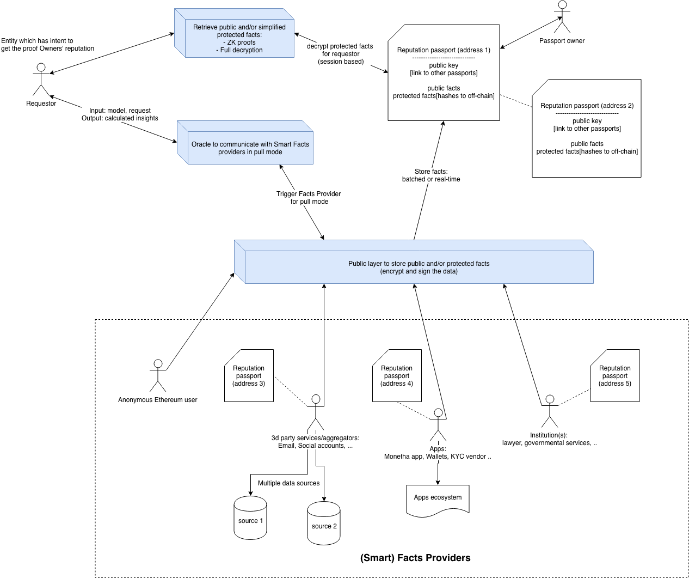

# MONETHA: decentralized reputation platform

# Reputation protocol

* [Abstract](#abstract)
* [Trust and Reputation background](#trust-and-reputation-background)
* [Problem Statement](#problem-statement)
* [Protocol](#protocol)
    + [Model](#model)
    + [Technical](#technical)
    + [Token](#token-model)
* [Vulnerabilities and Attacks](#vulnerabilities-and-attacks)

## Abstract

Monetha is a decentralized reputation platform. Protocol behind the platform is designed in way which enables network participants to evaluate the trustworthiness of another party by securely accessing context-relevant information before initiating a transaction with another party in order to meet own's expectations.

We aim to increase confidence and probability of success for any transaction between parties by providing the protocol with following key elements and possibilities:

- A Passport which is a collection of data points about the entity (person, object, organization and etc.); stored in a secure and censorshiop esistant manner;
- Passport is not tied to a single vendor and allows you to transfer (use accross many platforms) your reputation capital;
- Exchange contextually relevent data with many requestors (applications, platforms, etc.);
- Own your data and manage access to it;
- Monetize your reputation capital;
- Utilities for 3rd party developers to build custom applications for specific use cases.

## Trust and Reputation background

**Trust** is a layered notion, used to refer to several different (although interrelated) meanings between entities X (Trustor) and Y (Trustee)

- in its basic sense, trust is a mental and affective attitude or disposition towards Y, or involving two basic types of beliefs: evaluations and expectations;
- in its richer use, trust is a decision and intention based on that disposition;
- as well as the act of relying upon Y's expected behavior;
- and the consequent social relation established between X and Y.

**Reputation** is the collective measure of reliability derived from the interactions between parties.

Trust systems produce a score that reflects a personalized view of an entity's trustworthiness, whereas reputation systems produce a reputation score of an individual as seen by the whole community.

Three tenets of distributed reputation systems:

- Entities are long lived and unique (identity solution)
- Ratings about current interactions must be captured and distributed (broadcasting by reputation reporters)
- Ratings about past interactions must guide current decisions (model execution by audit quorum)

### Trust is capital

There is a complex relation between power and trust. On the one hand power (and in particular perceived and appreciated power) makes us trustworthy for the others (they may need us and wish to rely on us), and this is why our _social image_ and the _signals_ that we give of our qualities are so important. As we will see, trust (being trusted in a given community, and in particular being better evaluated than others) is _capital_.

On the other hand, this is capital precisely because it increases our power; it provides us new power. Since we (being perceived as trustworthy) are appreciated and demanded, we can enter in exchange relations, we can receive cooperation, we can influence other people, etc. This means that we greatly enlarge our _practical power_ (the possibility to achieve – thanks to the other's cooperation – our goals) and _social power_, power on the others. Also for being invested by institutional roles (and receive new special powers) we need some competence and reliability, or even better, we need some trust from others on this. In sum, _power gives trustworthiness and trust from the others; and trust gives power._

### Trust is context-dependent

Trust is a context-dependent phenomenon and notion. This means that _X_ trusts _Y_ for τ on the basis of a specific context; just changing the context (for the same τ and the same _Y_) _X_'s attitude and decision might be different.

### Bigger trust != pick him

We do not necessarily delegate to the most trustworthy agent; we do not necessarily choose the alternative where the trust is greater. We might prefer to choose a partner or to rely on a device that is not the most reliable one, simply because there are other parameters involved in our decision to delegate (to 'trust', as action): costs, risks, utility and so on. For example, the most competent and trustworthy doctor might be the most expensive or not immediately available (because very busy). In this case, we could delegate a less competent and cheaper one.

### Trust can be incentivized and persuaded

This is also why trust and trust decisions can be the object of argumentation and persuasion: I can provide you with reasons for trusting or not trusting _Y_; I can convince you. Of course, trust can also be the result of a mere suggestion, of manipulation, of attraction, and other affective maneuvers; but here we were modeling explicit and arguable trust.

It is also important to notice that the impact of such a degree of trust in decision making is not just due to the 'expected utility'; the process is more complex: there are specific thresholds, there are differences between high probability and low value versus low probability and high value.

Trust before transaction vs Trust after transaction

It is also important not to have simplistic models of trust degree in terms of mere statistics or reinforcement learning; or of trust decision in terms of delegating to the most trustful guy. An important additional sophistication we should have introduced – at least for modeling human trust – would be the asymmetric evaluation of gains (and missed gains) and of losses (and avoided losses), as explained by 'Prospect Theory': the same amount of money (for example) does not have a comparable impact on our decision when considered as acquisition and when considered as loss; and, as for losses, we are risk prone (we prefer uncertain losses to certain losses), while for winnings we are risk averse (prefer certain winnings to uncertain ones) (Allais, 1953).

### Control increases trust

Control is useful and can be a remedy in both cases, but with different roles. Control means in fact :

- The possibility of improving _trustee_'s performance, or of intervening in time – on the basis of new evidence – for remedying, revoking the delegation, etc. Control is a remedy to low expectations about _trustee_.
- The possibility of acquiring, through _monitoring,_ additional evidence and information run-time.

### *References:*
- *"Trust Theory: A Socio-Cognitive and Computational Model" by Cristiano Castelfranchi,  Rino Falcone*
- *Computational Models of Trust and Reputation: Agents, Evolutionary Games, and Social Networks by Lik Mui*
- *A trustless privacy-preserving reputation system Alexander Schaub, Remi Bazin, Omar Hasan, and Lionel Brunie*
- *Sepandar D. Kamvar, Mario T. Schlosser, and Hector Garcia-Molina. The EigenTrust algorithm for reputation management in p2p networks.*
- *Stefan Dziembowski1, Sebastian Faust, and Kristina Hostakova. General State Channel Networks*

## Problem statement

Party1 wants to initiate a value exchange action with Party2. Although Party1 is not certain if her expectations are going to be met as she doesn't have enough information about Party 2

Very often Party 1 would be looking for following information:

- Hard facts: proof of identity, proof of payments, credit score
- Proof of historical performance (preferred with similar people like me)
- Recommendations from a social circle (the ones she knows)
- Comparison with alternatives

Access to information described above becomes even more important when:

- Cost of transaction is close to person's limits (e.g. with monthly income 1000$ a transaction for 100$ or 9000$ would lead to a completely different decision making process)
- Emotion is tied to a transaction (e.g. hiring a nanny, buying a pet, renting your car/flat, selling something of a sentimental value, getting a mortgage, choosing a roomate etc.)

Current reputation platforms often provide averaged scores and personalized expectations are not taken into account. And we can personalize reputation, increase sense of trustworthiness and security having information described above available upon the request.

## Protocol

Protocol is aiming to create generalized solution for the problem described above and allow network participants to use it as foundation for trustful communication.

Our development is driven by following principles:
- Open-sourced project;
- Protocol contracts are upgradable;
- Censorship resistance is our main target. Passport owner controls write permissions and access to private data;
- Misuse is easily detectable;
- Platform is users and developers friendly;
- Improvements are driven by community via Improvement proposals, bug bounty and other means.

### Model

##### Reputation Passport Owner

Entity that has an incentive to establish censorship resistant representation of trustworthiness. Depending on a use case motivation can differ: get access to services (loan, rent a house and etc.), proof credibility of previous deals, monetize valuable information and etc.

Passport owner types:

- Person
- Item
- Entity
- Organization
- Service provider

Passports can be linked to represent specific relation with other objects (depending on implementation can also be treated as registered facts), e.g.:
- Person owns items
- People are working for the company or service provider

Information is stored in a public or private manner on behalf of facts providers. Passport owner grants access per each data point stored on the passport.

##### Facts Provider

3d parties can provide simple facts (e.g. # of deals made, # of claims made and etc.) about Passport owner in a permissionless manner from content perspective.

Facts provider can acts in push mode by default. Data can be provided as public or private based on Passport owner settings.

##### Smart Facts Provider

3d parties also can act as Smart Facts providers. In this case they can provide complex/combined inputs and/or extended insights (e.g. probability of claim, estimated deal duration) by applying mathematical models to their data and/or passport's data (both public and private) for Passport owner.

Smart Facts provider can act in pull or push mode. Data can be provided as public or private based on Passport owner settings. In addition Smart Facts providers might not be storing information to the Passport.

##### Requestor

Anyone who has an incentive to get access to public or private facts (e.g. extended reviews, if above certain age, if is in the country) or calculated insights by smart facts providers (e.g. social score calculated based on public and private facts)

### Technical

#### Main concept

#### Facts provisioning

Protocol is designed to be flexible and gives users a possibility to decide how to store information a) on-chain or off-chain b) in a public or private manner. How exactly specific information is going to be stored is left for the users to decide as it involves financial and security aspects which are best known by the users themselves and different options can be used depending on the context.

Facts providers types:

- Registered
  - Well-known and trusted source (e.g. governmental services)
  - Applications where Passport is linked
- Unknown
  - Anybody can provide additional information about Passport holder

Considerations

- On-chain (Ethereum) storage
  - Transactions data
  - Event logs
  - Blockchain storage
- Off-chain (IPFS) storage
  - Data from a single provider is stored as linked list off-chain
  - Only _hash_ is stored on-chain and the rest of information is appended to the list
- Private data
  - Encrypted
  - Prepared for Zero Knowledge proofs (where possible to apply)
- All data inputs (stored via protocol) are signed by facts providers (anonymous or known)
- Anyone (application, sercice provider or a person) can store data to the passport. But there is a classification of facts providers:
  - Anonymous -> any address
  - Known -> facts provider has its own passport and is whitelisted in a specific registry of facts providers (which are assumed more trusted as the disclose their identity)

### Token model

Number of requests to get access to private data stored within the Passport. Tokens are distributed from Requestor to Facts Provider and Passport owner.

_Work in progress_

## Vulnerabilities and Attacks

### Facts spam

Protocol enables anyone to provide facts into a Passport

Solution:

- Facts provisioning costs money
- Categorization of facts providers
  - Trusted facts providers are registered and well-known
  - Facts providers have their own Reputation passport
  - Information provided by Unknown facts providers most probably will not be taken into account by Requestor
- Owner fully controls where and how passport is used
- Owner can control who (what facts provider) and how (public or private mode) stores data, but cannot control what is stored (content itself)

### Sybil attack

In a fully decentralized model (depending on implementation of how trust of facts providers is solved) Facts Providers can create multiple representations of themselves to do harm to Reputation passport holder

Solution:

- Facts Providers have their own Reputation passport
- Facts Providers must to have something at stake if their results are proven to be wrong

### Data anonymity

Passport will hold sensitive information about owner so incentive to hack the platform is very high

Solution:

- Bug bounty
- Working with security groups
- Open sourcing the platform

### Stealing MTH tokens

Facts Providers and Passport owners are paid with tokens when their information is used.

Solution:

- Do not hold funds of network participants
- Tokens must be distributed as soon as request is executed

### "Wrong" facts

Passport owner might want to disagree with specific data points provided by trusted or unknown facts providers.

Solution:

- Apply same protocol to solve this case. Facts provider has it's own passport. Dispute can be treated as a set of additional data points from a Passport owner towards the facts provider.
- Such information can be taken into account by Requestor.

### Forking the protocol

Protocol can be forked or similar can be built.

Solution in favour of our implementation:

- Provide valuable and useful solution
- Partnerships with Facts providers
- Strong development community to build context specific solutions on top of the platform