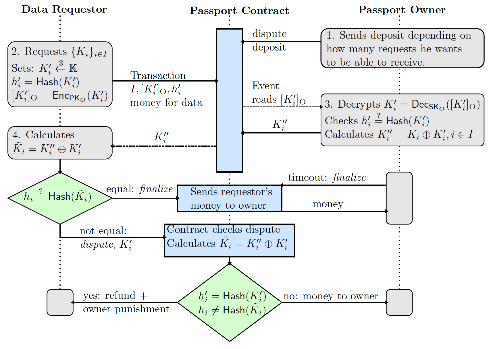

# MONETHA: Decentralized Reputation Framework

## Reputation Layer: Private data exchange protocol

* [Requirements](#requirements)
* [Design](#implementation)
* [Academic proof](#academic-proof)

## Requirements

R1: The proposed solution shall store information fully decentralized.

R2: The cost for storage shall be minimal.

R3: The time to retrieve data shall be within a reasonable timespan and the computational overheads on both the data provider and the requestor shall be minimal.

R4: The proposed solution shall satisfy the highest possible security standards, ideally backed up by formal security proofs. Moreover, it shall use state-of-the art cryptographic algorithms to guarantee security against attacks that are relevant according to the proposed trust model.

R5: The proposed technical solution allows for a user friendly integration i.e. into the Monetha-App. Also it should make sure that the protocoll is not disturbing the user by asking for too many confirmations.

R6: In case the solution relies on frameworks or other software, its maturity should allow a production feasible implementation.

## Design

The following figure shows the protocol describing how private data is requested. It currently uses one-way hash functions as the commitment scheme, which are only computationally binding and hiding (unlike the commonly-used Pedersen commitments) but readily and cheaply available in Ethereum smart contracts.

More detailed document describing the design is available here - [Private data exchange protocol v0.4](private-data-exchange-protocol-v04.pdf)  

## Academic proof

**_Work in progress_**

